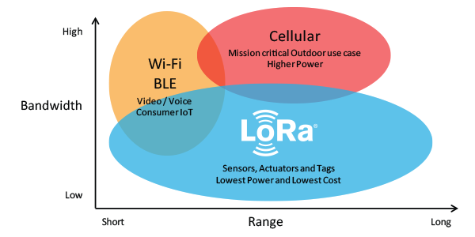

# LoRa32_DisasterRadio  
A tool might be useful in disaster! https://disaster.radio/   
and they got an intro youtube video here: https://youtu.be/uZkGudvjNzw

## ESP32 TTGO Lora32 w/ DisasterRadio.

An Arduino project forked and tailored for LoRa32(v1)...
  
Use Cases...

  

Lora got smaller bandwidth(power) but much longer Range...

  

Disaster-Radio builtin Web interface w/ LoRa32v1 module, codes are in PlatformIO/project/firmware folder.  
 &nbsp;&nbsp;&nbsp;
  

_Another interesting project, see linked reference._ 

  
## References
  - [Arduino LoRa Library](https://github.com/sandeepmistry/arduino-LoRa) An Arduino library for sending and receiving data using LoRa radios.
  - [DisasterRadio](https://github.com/sudomesh/disaster-radio) _disaster.radio_ is a work-in-progress long-range, low-bandwidth wireless disaster recovery mesh network powered by the sun.
  - [Online Solar Irradiance figures](http://www.solarelectricityhandbook.com/solar-irradiance.html) Nice guide to check the city w/ solar irradiance.
  - [Sparrow Platform](https://github.com/sparrow-platform/sparrow/wiki) Medical and psychological well-being during and after disasters is a two-part communication and logistics problem...
